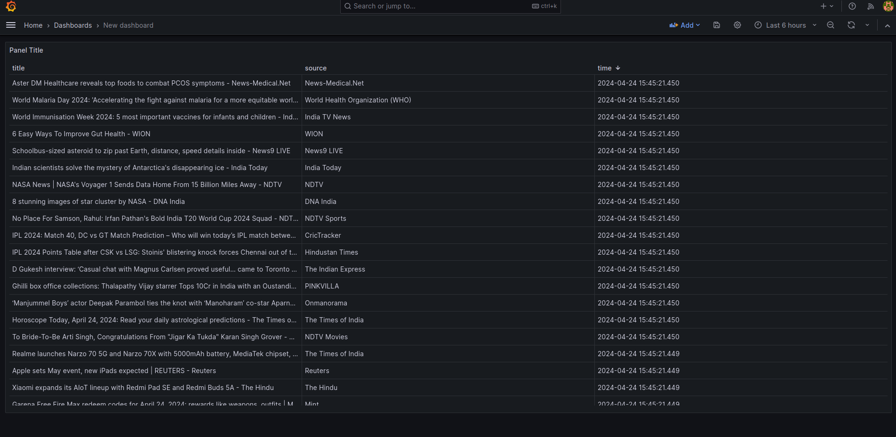
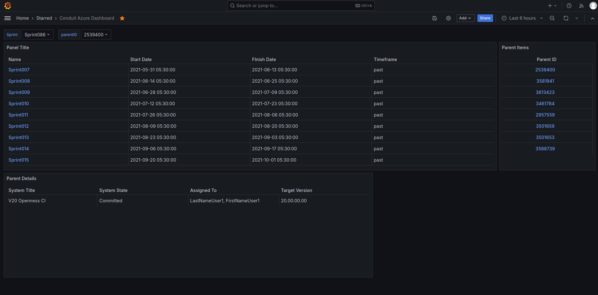

# Conduit

Conduit is an application that acts as a bridge between Azure DevOps and Grafana, allowing you to display project details in a beautiful dashboard.

## Instructions
- Place docs/ParentTask1Sprint86Dump.json docs/Sprint86Dump.json docs/SprintsDump.json in correct places to run the bridge with example dump
- Install [Infinity Datasource](https://grafana.com/docs/plugins/yesoreyeram-infinity-datasource/latest/) as per the instructions
- You can use `uv` to install requirements by running `uv sync` against `uv.lock` else plain old requirements.txt works
- Start the api server : `uv run conduit/main.py`
- Start grafana service and open grafana locally.
- Import dashboard by uploading the dashboard json export

> [!NOTE]
> There are TODO comments in the main script to use example json dumps. Remove them once the sprintlist api endpoint works. Rest should work outside the box
> The server has certain endpoints which query someother endpoints of its own. Could be better optimized by storing or caching.

## Endpoints 
/

## Features

- Fetch data from Azure DevOps
- Transform and aggregate data
- Display data in Grafana dashboard

## Tasks
- [x] Fetch RSS Feed and parse to display in grafana

- [x] Display Json Dumps

